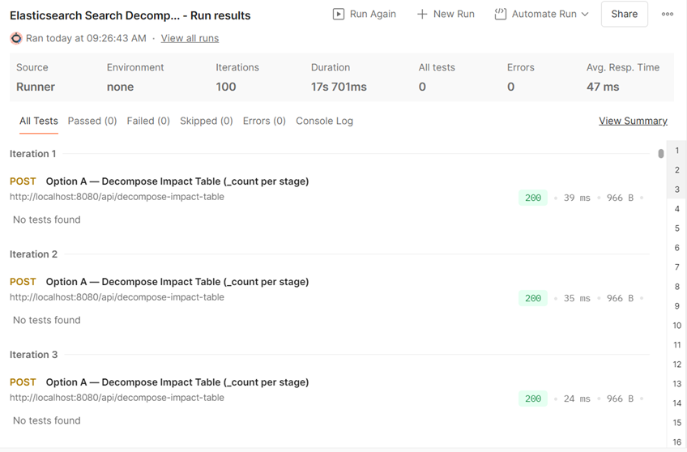
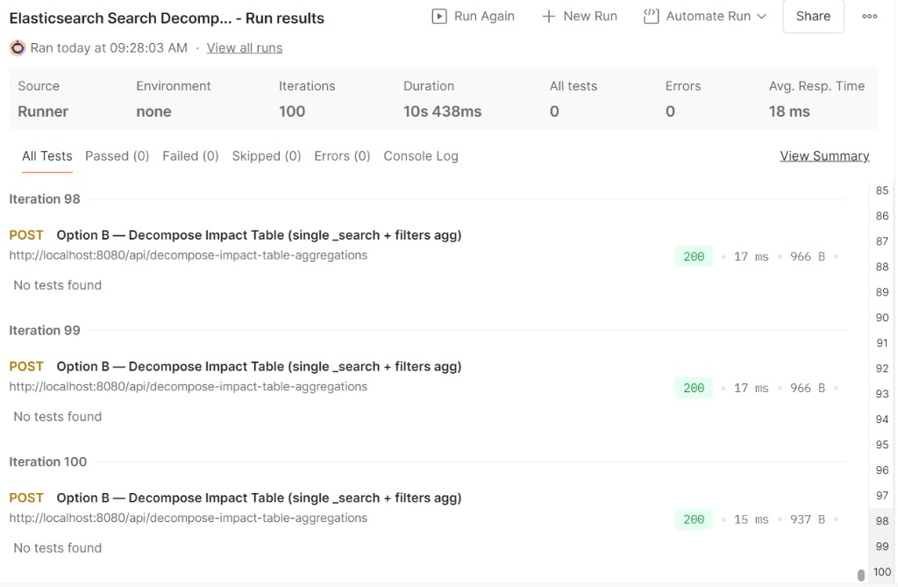

# Performance Testing — Elasticsearch Search Decomposition MVP

## 1. Objective

This test compares the performance of two implementations of the same feature:

- **Option A**: Multiple `_count` requests (per stage)
- **Option B**: Single `_search` request using a `filters` aggregation

The goal is to measure which approach is more efficient end-to-end (API latency observed from the client).

## 2. Test Setup

- **Tool used**: Postman Collection Runner
- **Iterations**: 100
- **Delay**: 0 ms
- **Payload**: Same JSON query body for both endpoints
- **Environment**: `localhost` (Spring Boot app calling Elasticsearch)

## 3. Test Endpoints

### Option A — Multiple Queries

- `POST /api/decompose-impact-table`
- Executes multiple Elasticsearch `_count` calls (one per cumulative stage)

### Option B — Aggregation Approach

- `POST /api/decompose-impact-table-aggregations`
- Executes a single Elasticsearch `_search` call
- Uses a `filters` aggregation to compute per-stage counts

## 4. Test Results (from Postman Runner screenshots)

### Option A — Multiple `_count` requests

- **Iterations**: 100  
- **Total runner duration**: **~17.701 s**  
- **Average response time**: **~47 ms**

### Option B — Single `_search` + `filters` aggregation

- **Iterations**: 100  
- **Total runner duration**: **~10.438 s**  
- **Average response time**: **~18 ms**

## 5. Observations

- **Option A (multiple calls)**:
  - Each stage triggers a separate Elasticsearch `_count` request
  - More round trips → higher overhead
  - Latency tends to grow with more stages (\(N\) ES calls per request)

- **Option B (single aggregation)**:
  - Only one Elasticsearch request per API call
  - Per-stage counts computed inside Elasticsearch via aggregation
  - Typically more scalable as decomposition depth increases

## 6. Conclusion

Based on the Postman Runner averages captured above, **Option B is faster** in this setup (lower observed average response time and lower total runner duration for the same number of iterations).

## 7. Notes / Limitations

- These timings are **end-to-end client-observed API latency**, not a pure Elasticsearch benchmark.
- Results depend on local machine load, JVM warm-up, Elasticsearch cache state, and dataset size.

